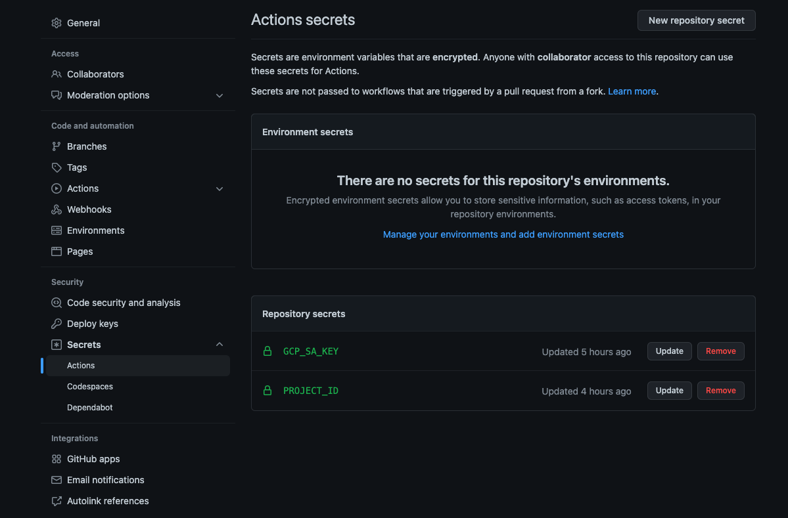

# GitHub Package Deploy to Google Cloud Run

A Github Action template for who need to deploy to Google Cloud Run from GitHub package

## Quickstart

### Create a service account

```sh
gcloud iam service-accounts create github-package-cloud-run \
    --description="Deploy to Cloud from Github Package" \
    --display-name="github-package-cloud-run"
```

### Get service account key

```sh
# Find service account you created previous step
gcloud iam service-accounts list

# Get service account email
gcloud iam service-accounts keys create $PWD/key.json \
--iam-account=<Your service account email>
```

### Add role to service account

- roles/storage.objectViewer
- roles/storage.legacyBucketWriter
- roles/run.admin

```sh
gcloud projects add-iam-policy-binding <Your project \
  --member="serviceAccount:<Your service account email>" \
  --role=<Role to grant>   
```

### Add secret on GitHub

- Go Your Repository -> Settings -> Secrets -> Actions
- `GCP_SA_KEY` -> Your key json file
- `PROJECT_ID` -> Your GCP project ID 



### Run GitHub Action

- Push something to main branch then github action will be triggered.

## Modify GitHub Action config file

### GitHub Action triggered timing

- [Change GitHub action trigger timing](https://github.com/liaojason2/node-github-package-cloud-run/blob/main/.github/workflows/build-push-docker-image-to-github-package.yaml#L12-L14)

### Docker image name

- [Change Image name when build docker image](https://github.com/liaojason2/node-github-package-cloud-run/blob/main/.github/workflows/build-push-docker-image-to-github-package.yaml#L18)

- [Change Image name when build docker image](https://github.com/liaojason2/node-github-package-cloud-run/blob/main/.github/workflows/build-push-docker-image-to-github-package.yaml#L18)
- [Change Image name when deploy to gcr](https://github.com/liaojason2/node-github-package-cloud-run/blob/main/.github/workflows/deploy-to-google-cloud-run.yaml#L12)

### Google Cloud Run Service name

- [Change Image name when deploy to gcr](https://github.com/liaojason2/node-github-package-cloud-run/blob/main/.github/workflows/deploy-to-google-cloud-run.yaml#L15)

### Google Cloud Run region

- [Change Image name when deploy to gcr](https://github.com/liaojason2/node-github-package-cloud-run/blob/main/.github/workflows/deploy-to-google-cloud-run.yaml#L17)

## Contributing or help

File a issue if you need help or push a PR if you want to make this repo better.

## Reference

### GCP
 
- [Creating and managing service accounts](https://cloud.google.com/iam/docs/creating-managing-service-accounts)
- [Create and manage service account keys](https://cloud.google.com/iam/docs/creating-managing-service-account-keys#creating)
- [Manage access to projects, folders, and organizations](https://cloud.google.com/iam/docs/granting-changing-revoking-access#view-access)
- [Container Registry - Access control with IAM](https://cloud.google.com/container-registry/docs/access-control)

### GitHub

- [GitHub Action context](https://docs.github.com/en/actions/learn-github-actions/contexts)
- [https://docs.github.com/en/actions/publishing-packages/publishing-docker-images#publishing-images-to-github-packages](https://docs.github.com/en/actions/publishing-packages/publishing-docker-images#publishing-images-to-github-packages)

### Blogs & Others

- [Uploading a Docker image to GCR using Github Actions](https://medium.com/mistergreen-engineering/uploading-a-docker-image-to-gcr-using-github-actions-92e1cdf14811)